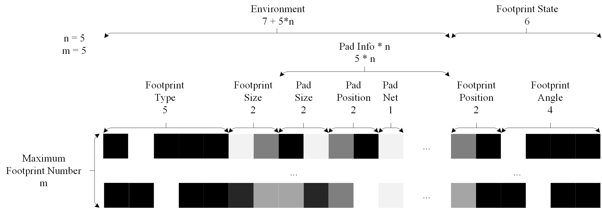

#  PCB Design Action Labeler

PCB Design Action Labeler (PDAL) is a plugin specifically designed for KiCad that allows user to label their PCB design action to specific task number and language instructions.

PDAL and PCB Design Action Recorder ([PDAR](https://github.com/fleaxiao/PDAR_plugin.git)) are series plugins. These plugins are recommend to use together, which fully log the human's thinking during PCB design process. Please make sure the `constant.py` files in each plugin are identical.

 > **Note:** This plugin has only been tested with KiCad 8.0. It's likely incompatible with later versions.

## Setup

1. Launch `KiCad Command Prompt` and install the requirement of package in requirement.yml. 

2. Launch `KiCad` and download plugin.
    - Navigate to the folder where plugins are stored: `KiCad -> Tools -> External Plugins -> Open plugin Directory`

    - Open a terminal and change directory to the plugin folder:
        ```bash
        cd [path-to-plugins-folder]
        ```

    - Clone the PDAL_plugin repository:
        ```bash
        git clone https://github.com/fleaxiao/PDAL_plugin.git
        ```

    - Refresh your plugins in KiCad: `KiCad -> Tools -> External Plugins -> Refresh Plugins`

The PDAL plugin should now be visible in the menu of KiCad.

## Usage

1. Open both schematic file and PCB layout file. Make sure the PCB layout is empty.

2. `Initialization:` The components from the schematic will be imported to the PCB layout design environment. 

3. `Load:` The `.json` record file should be selected. 

4. `Play:` The recorded PCB design action will be played. The number of action step is controlled by the bar.

5. `Label:` After typing the specific task number and language instructions, a new label and image files will be exported.


## Acknowledge

The logo of this plugin is designed by Freepik from Flaticon.

## Contact

If you have any questions, please contact me at x.yang2@tue.nl